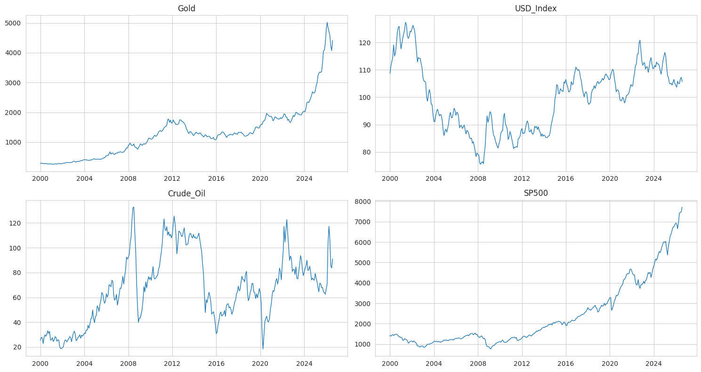
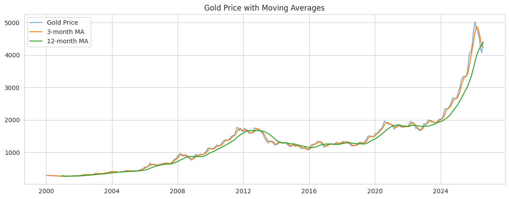
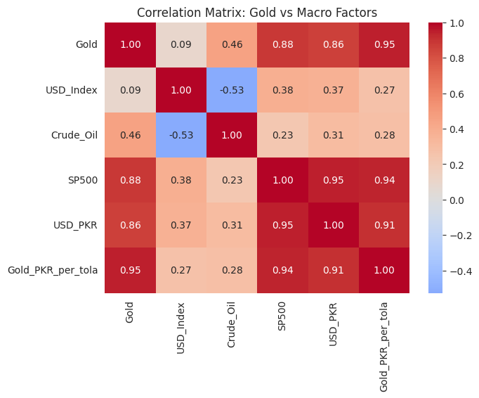
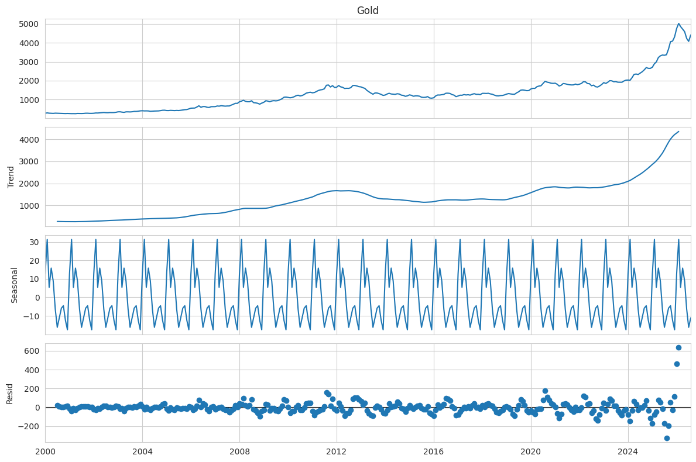
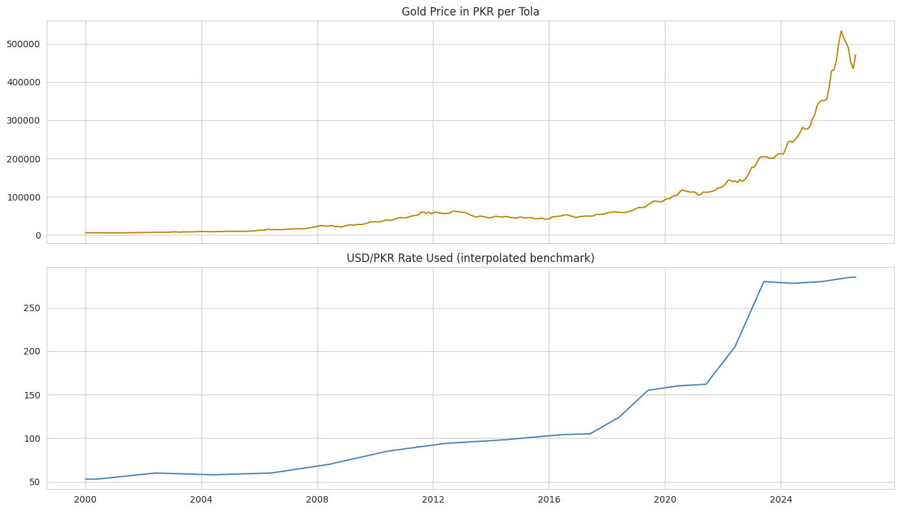
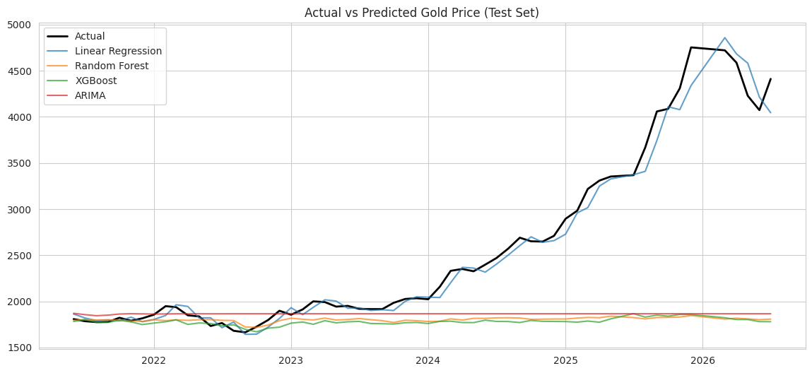
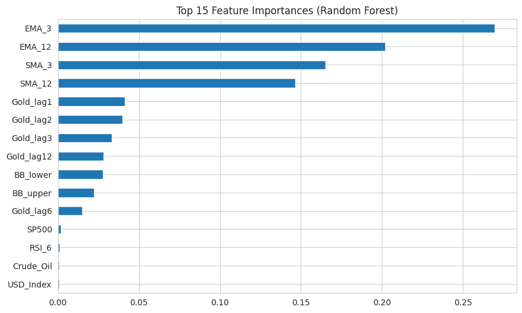
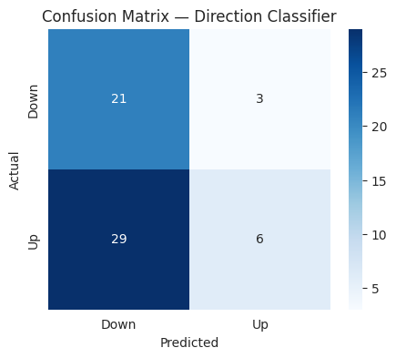
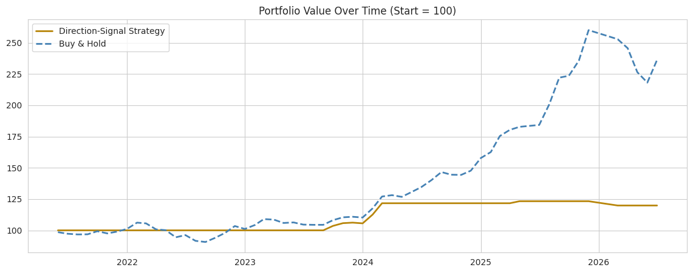

# 🪙 Gold Price Analysis & Forecasting

A macro-aware machine learning project that analyzes and forecasts gold prices using their
relationship with the US Dollar Index, Crude Oil, and the S&P 500 — instead of treating gold
as an isolated price series. Includes a Pakistan-specific PKR view and a trading-strategy
backtest, delivered as both a research notebook and an interactive Streamlit dashboard.

---

## Table of Contents

1. [Project Overview & Objectives](#1-project-overview--objectives)
2. [Features & Technologies Used](#2-features--technologies-used)
3. [Installation / Setup](#3-installation--setup)
4. [Usage & Screenshots](#4-usage--screenshots)
5. [System Workflow / Architecture](#5-system-workflow--architecture)
6. [Testing & Results](#6-testing--results)
7. [Challenges & Future Improvements](#7-challenges--future-improvements)
8. [Conclusion & References](#8-conclusion--references)

---

## 1. Project Overview & Objectives

Gold is widely treated as a **safe-haven asset** and an **inflation hedge**. Unlike a company
stock, its price is driven less by "fundamentals" (earnings, growth) and more by
**macroeconomic forces** — USD strength, crude oil, and equity-market stress.

**Objective:** go beyond a naive "predict tomorrow's price" model by:
- Quantifying how much of gold's movement is explained by USD, oil, and equity behaviour
- Comparing multiple forecasting paradigms (classical statistical vs. machine learning)
- Converting the analysis into a **Pakistan-specific PKR view**, since PKR's depreciation
  against USD is one reason gold is a popular local inflation hedge
- Testing whether the model's Up/Down signal would have actually **beaten a simple Buy & Hold
  strategy** — and reporting that result honestly, whichever way it goes

## 2. Features & Technologies Used

**Core features**
- Live data loading from public, real sources (no scraping, no synthetic data)
- Exploratory Data Analysis: trend charts, moving averages, rolling volatility
- Correlation analysis between Gold, USD Index, Crude Oil, and S&P 500
- Time series diagnostics: stationarity (ADF test), seasonal decomposition
- Feature engineering: SMA/EMA, RSI, MACD, Bollinger Bands, lag features, macro % changes
- Four forecasting models compared: Linear Regression, Random Forest, XGBoost, ARIMA
- Direction classifier (Up/Down) with confusion matrix
- **PKR conversion** — Gold price in PKR/tola using a benchmark-interpolated USD/PKR series
- **Backtest** — a simple direction-signal trading strategy vs. Buy & Hold, with Sharpe ratio
  and max drawdown
- Interactive Streamlit dashboard with a year/month explorer and a monthly-returns heatmap

**Technologies**

| Category | Tools |
|---|---|
| Language | Python 3 |
| Data handling | pandas, numpy |
| Visualization (notebook) | matplotlib, seaborn |
| Visualization (dashboard) | Plotly |
| Machine Learning | scikit-learn (Linear Regression, Random Forest), XGBoost |
| Time Series | statsmodels (ARIMA, seasonal decomposition, ADF test) |
| Dashboard | Streamlit |
| Environment | Jupyter Notebook |

## 3. Installation / Setup

```bash
# 1. Clone or download this repository
git clone <your-repo-url>
cd gold-price-forecasting

# 2. Install dependencies
pip install pandas numpy matplotlib seaborn scikit-learn statsmodels xgboost streamlit plotly

# 3a. Run the research notebook
jupyter notebook Gold_Price_Forecasting.ipynb

# 3b. OR launch the interactive dashboard
streamlit run gold_forecasting_app.py
```

No API keys are required — all data loads live from free, public sources at runtime.

## 4. Usage & Screenshots

**Notebook:** open `Gold_Price_Forecasting.ipynb` and run all cells top to bottom. Each
section (data collection, EDA, feature engineering, modeling, backtest) runs independently
and prints/plots its own output.

**Dashboard:** run `streamlit run gold_forecasting_app.py`, then open the local URL it prints.
The sidebar lets you pick a data start year and toggle the PKR view; the tabs cover Trends,
a Year/Month Explorer (with a monthly-returns heatmap), Correlations, Forecasting Models, a
Live Prediction tool, and the Backtest.

Below are real outputs generated by this project:

**Raw data trends across all four series**


**Gold price with moving averages**


**Correlation matrix — Gold vs. macro factors**


**Seasonal decomposition of the gold price series**


**Gold price converted to PKR per tola**


**Actual vs. predicted price on the test set**


**Feature importance (Random Forest)**


**Direction classifier confusion matrix**


**Backtest — strategy vs. Buy & Hold**


## 5. System Workflow / Architecture

```
                    ┌──────────────────────┐
                    │   Live Public Data    │
                    │  (4 real CSV sources) │
                    │ Gold · Oil · S&P500 · │
                    │   USD Index (proxy)   │
                    └──────────┬───────────┘
                               ▼
                    ┌──────────────────────┐
                    │   Data Merging &      │
                    │   Cleaning (pandas)   │
                    └──────────┬───────────┘
                               ▼
                    ┌──────────────────────┐
                    │ Feature Engineering   │
                    │ SMA/EMA · RSI · MACD  │
                    │ Bollinger · Lags      │
                    └──────────┬───────────┘
                               ▼
              ┌────────────────┴────────────────┐
              ▼                                  ▼
    ┌──────────────────┐              ┌──────────────────────┐
    │ Regression Models │              │ Direction Classifier  │
    │ Linear / RF / XGB │              │  (Random Forest)      │
    │     / ARIMA       │              └──────────┬───────────┘
    └─────────┬─────────┘                         ▼
              │                        ┌──────────────────────┐
              │                        │  Backtest Simulation  │
              │                        │ Strategy vs Buy&Hold  │
              │                        └──────────┬───────────┘
              ▼                                   ▼
    ┌────────────────────────────────────────────────────┐
    │        Outputs: Jupyter Notebook (research)          │
    │        + Streamlit Dashboard (interactive)           │
    └────────────────────────────────────────────────────┘
```

The notebook and the dashboard share the same underlying logic (data loading → feature
engineering → modeling) so their results stay consistent; the dashboard adds interactivity
(year/month exploration, live prediction) on top.

## 6. Testing & Results

Dataset: 320 monthly observations (2000–2026); 293 rows remain after feature engineering
(lag features consume the first few rows).

**Regression model comparison (test set, chronological split):**

| Model | RMSE | MAE | R² | MAPE |
|---|---|---|---|---|
| **Linear Regression** | **125.51** | **85.39** | **0.981** | **3.07%** |
| ARIMA | 1084.58 | 665.62 | -0.482 | 19.86% |
| Random Forest | 1158.68 | 735.66 | -0.598 | 21.78% |
| XGBoost | 1164.65 | 752.55 | -0.615 | 22.56% |

Linear Regression wins decisively here — with under 300 monthly rows, the tree-based models
don't have enough data to find real non-linear structure and default to overfitting the
training period.

**Direction classifier (Up/Down):**

| Metric | Value |
|---|---|
| Accuracy | 45.8% |
| Precision | 66.7% |
| Recall | 17.1% |
| F1 Score | 27.3% |

**Backtest — Direction-Signal Strategy vs. Buy & Hold:**

| Strategy | Total Return | Sharpe Ratio | Max Drawdown |
|---|---|---|---|
| Direction-Signal Strategy | +19.9% | 0.74 | -2.8% |
| Buy & Hold | **+136.2%** | **1.36** | -16.1% |

**Honest takeaway:** Buy & Hold clearly outperforms the classifier-driven strategy over this
test period. Reporting this rather than only favorable numbers is deliberate — a credible
project should show where a model does *not* yet add value, not just where it looks good.

## 7. Challenges & Future Improvements

**Challenges encountered:**
- No free, no-login, direct-CSV source exists for full daily gold or USD Index history —
  the best free sources are **monthly**, which limits the dataset to ~300 rows.
- No free, no-login source exists for full USD/PKR history either — the PKR view uses
  benchmark-year interpolation rather than a true daily quote.
- With a small monthly dataset, tree-based models (Random Forest, XGBoost) underperform a
  simple Linear Regression baseline — a useful, if humbling, real-world lesson about model
  complexity vs. data size.
- The direction classifier's low recall (17%) shows it's conservative about calling "Up"
  moves, which hurt the backtest's total return relative to Buy & Hold.

**Future improvements:**
- Move to a paid or higher-frequency data provider for daily/intraday granularity
- Add real historical PKR/USD daily data (e.g., via a licensed FX data provider)
- Add news/sentiment features (central bank statements, geopolitical headlines)
- Try an LSTM or Prophet model for comparison against the classical/ML baselines here
- Extend the backtest with realistic transaction costs, slippage, and position sizing
- Add automated data-refresh scheduling for the dashboard

## 8. Conclusion & References

This project demonstrates an end-to-end forecasting pipeline that grounds gold price
movement in macroeconomic reasoning rather than isolated price history, compares multiple
modeling paradigms honestly, and translates the analysis into a locally relevant (PKR) and
practically testable (backtest) form — which matters more for a credible financial ML
project than optimizing a single metric.

**Data sources:**
- Gold price: [datasets/gold-prices](https://github.com/datasets/gold-prices) (World Bank Commodity Markets data)
- Crude Oil (Brent): [datasets/oil-prices](https://github.com/datasets/oil-prices)
- S&P 500: [datasets/s-and-p-500](https://github.com/datasets/s-and-p-500) (Shiller dataset extended with FRED)
- USD Index proxy: built from [datasets/exchange-rates](https://github.com/datasets/exchange-rates) (US Federal Reserve FX rates)

**Library documentation:**
- [pandas](https://pandas.pydata.org/docs/) · [scikit-learn](https://scikit-learn.org/stable/) · [XGBoost](https://xgboost.readthedocs.io/) · [statsmodels](https://www.statsmodels.org/stable/index.html) · [Streamlit](https://docs.streamlit.io/) · [Plotly](https://plotly.com/python/)
